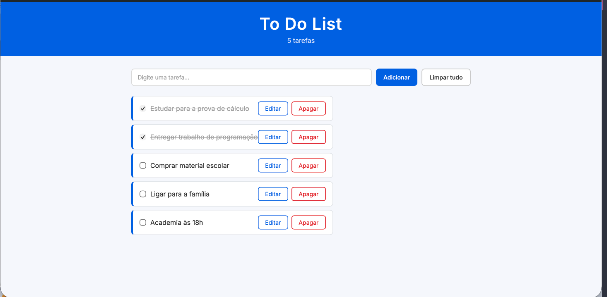

<h1 align="center">
  <br>
  To Do List
  <br>
</h1>

<p align="center">
  Projeto desenvolvido por Julia Duran para a 2ª Avaliação da disciplina Código de Alta Performance Web
</p>

<p align="center">
  
  
  
  
</p>

### Preview

<p align="center">
  
</p>

---

### Funcionalidades (CRUD)

| Operação | Descrição |
|---|---|
| **Criar** | Adicionar tarefas pelo campo de texto e botão Adicionar ou pressionando Enter |
| **Listar** | Visualizar todas as tarefas adicionadas na tela |
| **Atualizar** | Editar o texto de qualquer tarefa pelo botão Editar |
| **Remover** | Apagar uma tarefa individualmente ou limpar todas de uma vez |

---

### Funcionalidades extras

| Funcionalidade | Descrição |
|---|---|
| Marcar como concluída | Checkbox que risca a tarefa quando marcada |
| Contador de tarefas | Header exibe quantas tarefas estão na lista |
| Mensagem de lista vazia | Exibe mensagem quando não há tarefas |
| Limpar tudo | Botão que apaga todas as tarefas com confirmação |
| Persistência de dados | Tarefas salvas no LocalStorage — não somem ao fechar o navegador |
| Enter para adicionar | Pressionar Enter no campo adiciona a tarefa diretamente |

---

### Estrutura dos arquivos

| Arquivo | Responsabilidade |
|---|---|
| `index.html` | Estrutura e interface (HTML semântico) |
| `style.css` | Estilização (CSS) |
| `codigoaula.js` | Lógica, CRUD e LocalStorage (JavaScript) |

---

### Conceitos aplicados

| Conceito | Onde aparece |
|---|---|
| `const` | Declaração de todas as variáveis |
| Interpolação | Template literals no `innerHTML` e `console.log` |
| Arrow Function | Eventos `addEventListener` e `forEach` (ES6) |
| Function tradicional | Funções principais da aplicação |
| Array | Lista de tarefas no LocalStorage |
| `forEach` | Percorrer cards ao salvar e carregar |
| Concatenação com `+` | Contador de tarefas |
| Manipulação do DOM | `createElement`, `appendChild`, `removeChild` |
| LocalStorage | `setItem`, `getItem`, `JSON.stringify`, `JSON.parse` |

---

### Como executar

1. Clone o repositório:
```bash
git clone https://github.com/seu-usuario/todo-list.git
```

2. Abra o arquivo `index.html` no navegador ou use o **Live Server** no VS Code.

---

<p align="center">
  Desenvolvido por <strong>Julia Duran</strong> · Disciplina: Código de Alta Performance Web · Professor: Ronaldo Cysne · UNI7
</p>